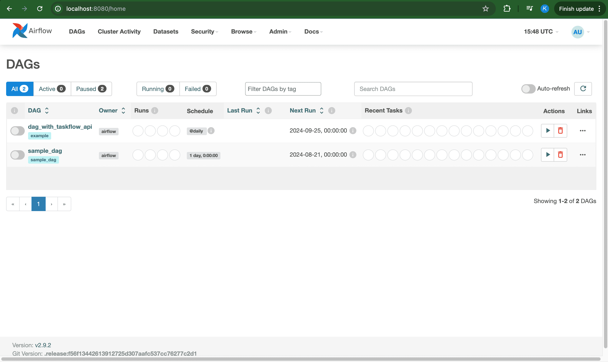

## Introduction

Airflow, formally known as Apache Airflow, is an open-source platform used to programmatically author, schedule, and monitor workflows. It users to create workflows as DAGs (directed acyclic graphs) of tasks, where each task represents an individual unit of work. In simple word it use to create data pipeline. It is primarily a batch-processing tool, meaning it schedules and runs tasks at intervals (e.g., every hour, daily).

## History of Apache Airflow

Apache Airflow is an open-source workflow orchestration platform created by **Maxime Beauchemin** at **Airbnb** in **2014** to address the company's growing data pipeline complexity. It was designed to schedule, monitor, and manage workflows through DAGs (Directed Acyclic Graphs). These DAGs enable users to define and visualize task dependencies, making it easier to automate data engineering processes. In **2015**, Airflow was **open-sourced**, allowing the broader tech community to adopt and contribute to its development.

## Why Airflow

The reason why airflow flow is more popular because **''pipeline as a Code''**. Pipeline as Code means that you define your entire data workflow or pipeline using Python code. Airflow represents pipelines as DAGs (Directed Acyclic Graphs), where tasks (individual steps) are written in code and linked based on dependencies.

## Basic terminology used in Airflow

1. **DAG (Directed Acyclic Graph)**: **Directed** means task moves in one direction. **Acyclic** means there are no loops task do not move in circles. **Graph** is the visual representation of diffrent tasks. So the defination is a collection of tasks with dependencies between them. It defines the overall workflow structure and ensures tasks are executed in the correct order without any loops.

2. **Task**: A single unit of work in a DAG. Such as running a Python script, pulling data from API, executing a Bash command, or sending an email. 

3. **Task Instance**: An instance of a task within a job, which can have its own state (e.g., running, success, failed).

4. **Job**: An instance of a DAG run, which can be triggered manually or automatically by a schedule.

5. **Operator**: Operators are predefined templates in Airflow to perform specific tasks (e.g., BashOperator for running shell commands, PythonOperator for executing Python code).

6. **Workflow**: Workflow is a sequence of tasks arranged in control depenency. Workflow and DAG can used interchangeably.

7. **Sensor**: A special type of operator that waits for a certain condition to be met before proceeding (e.g., waiting for a file to appear).

8. **Scheduler**: The component that monitors DAGs, schedules tasks, and determines when they should run based on their dependencies and schedules.

9. **Executor**: Responsible for running tasks. Airflow supports various executors (e.g., LocalExecutor, CeleryExecutor, KubernetesExecutor) to scale the execution of tasks.

10. **Hook**: Hooks manage connections to external systems (like databases or cloud services) and perform operations such as reading or writing data. or a way to extend Airflow's functionality by providing a custom interface to an external system or service.

11. **Trigger**: Specifies when a DAG or task should start. Triggers can be based on time schedules or external conditions (e.g., arrival of new data).

12. **XCom (Cross-communication)**: XComs are used for sharing data between tasks in a DAG. Tasks can "push" and "pull" data between each other using XComs.

13. **Pool**: A limited resource that can be used by tasks, such as a database connection or a file handle.

14. **Queue**: A buffer that holds tasks waiting to be executed by an executor.

15. **Connection**: A configuration for connecting to an external system, such as a database, file storage, or messaging service.

16. **Variable**: A key-value pair that can be used to store and retrieve values in Airflow, often used to configure tasks or DAGs.

17. **Plugin**: A package that adds new functionality to Airflow, such as new operators, sensors, or executors.

18. **DAG Run**: An instance of a DAG execution, which can be triggered manually or automatically by a schedule.

19. **Task Flow**: A sequence of tasks that are executed in a specific order, often triggered by a schedule or event.

20. **Airflow UI**: The web-based user interface for Airflow, which provides a visual representation of DAGs, tasks, and workflows.

21. **TaskFlow API**: A feature introduced in Airflow 2.0, enabling task creation via Python functions, making workflows easier to define and manage.

22. **DagRun**: An instance of a DAG, representing a specific execution of the workflow based on a scheduled time or manual trigger.

These terms are fundamental to understanding how Airflow works and how to build effective workflows.

## Airflow UI

