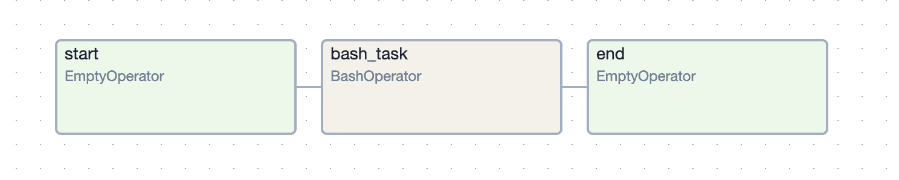
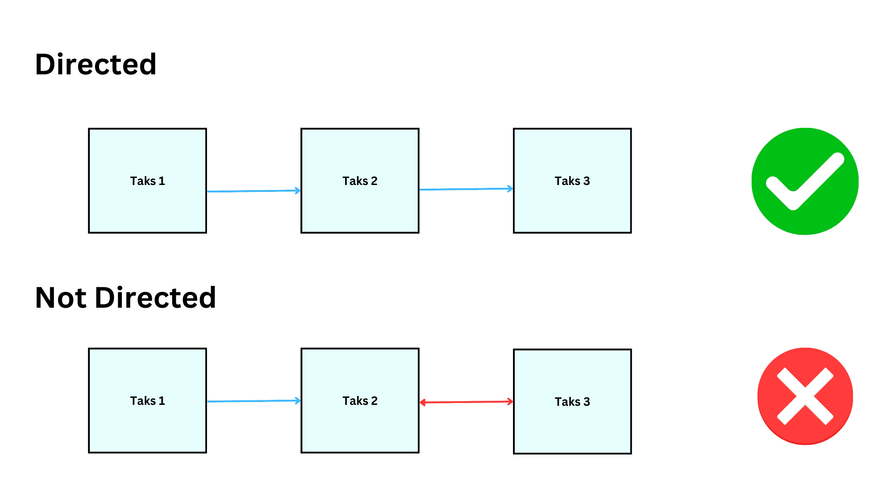
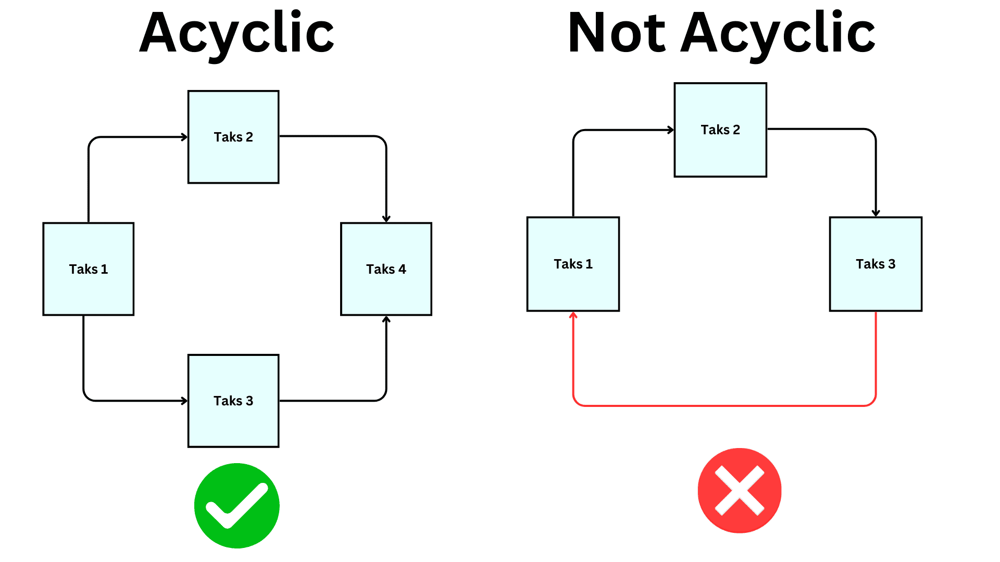

# Understanding DAGs in Apache Airflow

A **DAG (Directed Acyclic Graph)** is a data pipeline or workflow. DAGs form the backbone of workflow management and organization in Airflow. Dags contain a collection of tasks and dependencies that can be executed on given  schedule or time.

A DAG is defined in Python code and visualized in the Airflow UI. It can have single task or ten or undreds or thousands of tasks with complicated dependencies.

----------

Below screenshot shows a simple DAG graph in Airflow UI.

----------

## What is a DAG?

A **DAG (Directed Acyclic Graph)** is unidirectional, acyclic graph connecting the edges, where each node in the graph is a task, and edges define dependencies amongst tasks.

- **Directed**: That means task moves in one direction.

- **Acyclic**: There are no circular dependencies in a DAG. This means there are no loops task do not move in circles.

- **Graph**: A DAG graph is the visual representation of diffrent tasks. So the defination is a collection of tasks with dependencies between them.