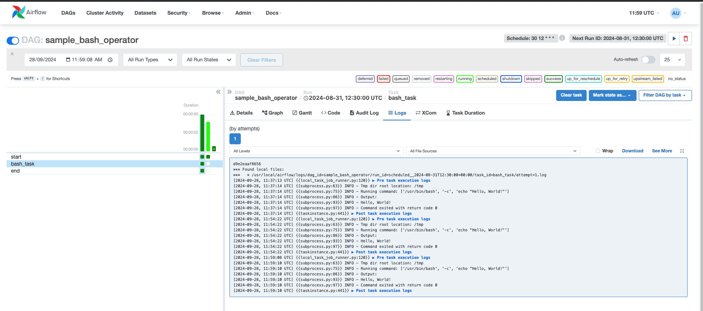

# Airflow Operators: The Building Blocks of Workflows

 At the heart of Airflow are operators, which are the building blocks of workflows. Operators define the work to be done by a task, and they can be combined to create complex workflows. In this page, we'll explore Airflow operators, their types, and examples of how to use them.

-----------------------------

## What are Airflow Operators?
Airflow operators are classes that define the work to be done by a task. They are the fundamental units of execution in Airflow, and they can be used to perform a wide range of tasks, from running Python scripts to sending emails. Operators are responsible for executing the actual work, and they can be combined to create complex workflows.

-----------------------------


## Types of Airflow Operators

Airflow provides a wide range of operators out of the box, including:

* **PythonOperator**: Executes a Python function
* **BashOperator**: Executes a Bash command
* **EmailOperator**: Sends an email
* **DummyOperator**: Does nothing, used to create dependencies between tasks.
* **EmptyOperator**: Does nothing, deprecated in Airflow 2.x, replaced by DummyOperator.
* **Sensor**: Waits for a specific condition to be met before proceeding
* **HttpOperator**: Makes an HTTP request
* **MySqlOperator**: Executes a MySQL query
* **PostgresOperator**: Executes a PostgreSQL query
* **SlackOperator**: Sends a message to a Slack channel
* **DockerOperator**: Runs a Docker container
* **KubernetesOperator**: Runs a Kubernetes pod
* **BigQueryOperator**: Executes a BigQuery query
* **CassandraOperator**: Executes a Cassandra query
* **ClickHouseOperator**: Executes a ClickHouse query
* **DruidOperator**: Executes a Druid query
* **ElasticsearchOperator**: Executes an Elasticsearch query
* **FtpOperator**: Transfers files using FTP
* **GoogleCloudStorageOperator**: Transfers files using Google Cloud Storage
* **HiveOperator**: Executes a Hive query
* **ImpalaOperator**: Executes an Impala query
* **JdbcOperator**: Executes a JDBC query

And many more!

-----------------------------


### Example: Using the BashOperator

Here's an example of using the BashOperator to execute a Bash command:
```python

from airflow.models import DAG
from airflow.operators.empty import EmptyOperator
from airflow.operators.bash import BashOperator
from datetime import datetime
import pytz

with DAG(
    dag_id='sample_bash_operator',
    start_date=datetime(2024,8,31,tzinfo=pytz.UTC),
    end_date=datetime(2024,9,15,tzinfo=pytz.UTC),
    schedule="30 12 * * *",
    max_active_runs=1,
    catchup=True,
    tags=['sample_bash_operator'],
) as dag:
    
    
    start: EmptyOperator=EmptyOperator(
        dag=dag,
        task_id="start"
    )
    
    
    bash_task: BashOperator = BashOperator(
    task_id='bash_task',
    bash_command='echo "Hello, World!"'
    )
    
    
    end: EmptyOperator=EmptyOperator(
        dag=dag,
        task_id="end"
    )
    
    #Set task dependencies
    start >> bash_task >> end
    
    # Make the DAGs globally avaiable
    globals()["dag_for_sample_bash_operator"]=dag

```

Below is the UI of airflow of above code:


